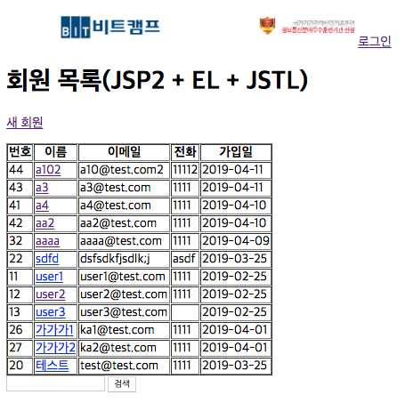
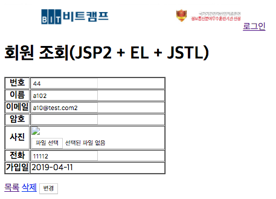

# UC002 - 매니저관리(Manager Management)

매니저를 등록, 조회, 변경, 삭제하는 유스케이스이다.

## 주 액터(Primary Actor)

관리자

## 보조 액터(Secondary Actor)

## 사전 조건(Preconditions)

- 관리자로 로그인 되어 있다.

## 종료 조건(Postconditions)

- 매니저를 등록하였다.
- 매니저를 조회하였다.
- 매니저를 변경하였다.
- 매니저를 삭제하였다.

## 시나리오(Flow of Evnets)

### 매니저 조회하기

1. 액터는 매니저 관리 메뉴를 클릭한다.
2. 시스템은 매니저 목록(매니저 이름, 이메일, 전화)을 출력한다.
3. 액터는 목록에서 매니저 이름을 클릭한다.
4. 시스템은 매니저 상세 정보(이름,이메일,전화,우편번호,기본주소,상세주소)를 출력한다.
    - 매니저가 존재하지 않는다면,
        - 시스템은 매니저가 존재하지 않는다는 내용을 출력한다.

### 매니저 등록하기 

1. 액터는 매니저 등록 버튼을 클릭한다.
2. 시스템은 매니저 등록 폼을 출력한다.
3. 액터는 이름, 이메일, 전화, 우편번호, 기본주소, 상세주소를 입력하고 등록 버튼을 누른다.
4. 시스템은 매니저 정보를 저장한 후 '매니저 조회하기' 유스케이스의 2번으로 간다.
    - 필수 입력 항목(이름, 이메일, 전화)이 비어 있다면,
        - 시스템은 필수 입력 항목이 비어 있음을 알린다.
    - 이메일이 중복되었다면,
        - 시스템은 이메일 중복을 알린다.

### 매니저 변경하기

1. 액터는 매니저 상세 정보 화면에서 이름, 이메일, 전화, 우편번호, 기본주소, 상세주소를 변경한다.
2. 시스템은 매니저 정보를 변경한 후 '매니저 조회하기' 유스케이스의 4번으로 간다.
    - 필수 입력 항목(이름, 이메일, 전화)이 비어 있다면,
        - 시스템은 필수 입력 항목이 비어 있음을 알린다.
    - 이메일이 중복되었다면,
        - 시스템은 이메일 중복을 알린다.

### 매니저 삭제하기

1. 액터는 매니저 상세 정보 화면에서 삭제 버튼을 클릭한다.
2. 시스템은 해당 회원을 삭제한 후 '매니저 조회하기' 유스케이스의 2번으로 간다.
    - 해당 회원이 없으면,
        - 시스템은 회원이 없음을 알린다.

## UI 프로토타입

### 매니저 목록

### 매니저 상세보기
