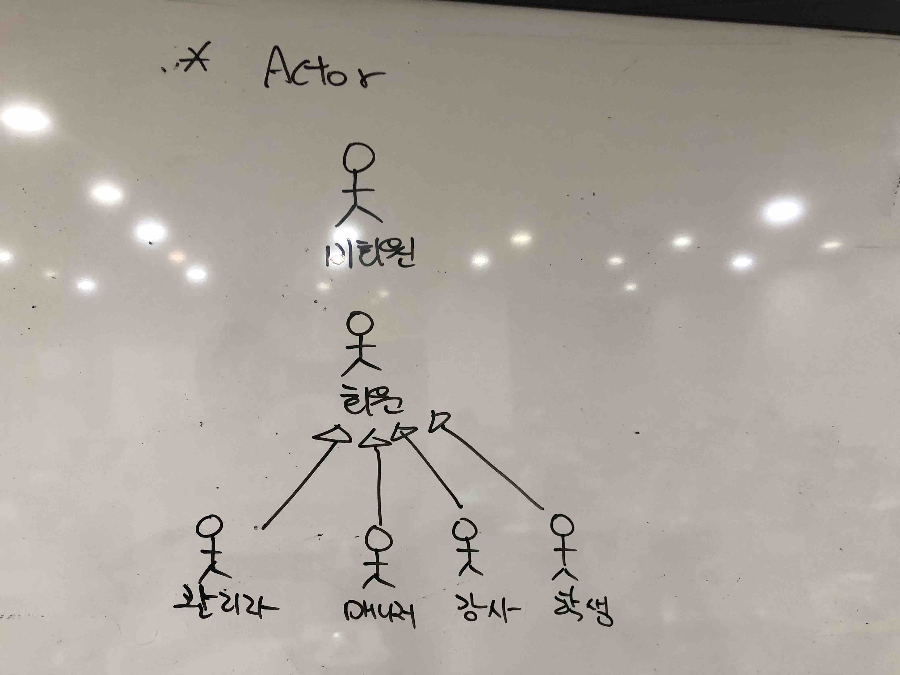
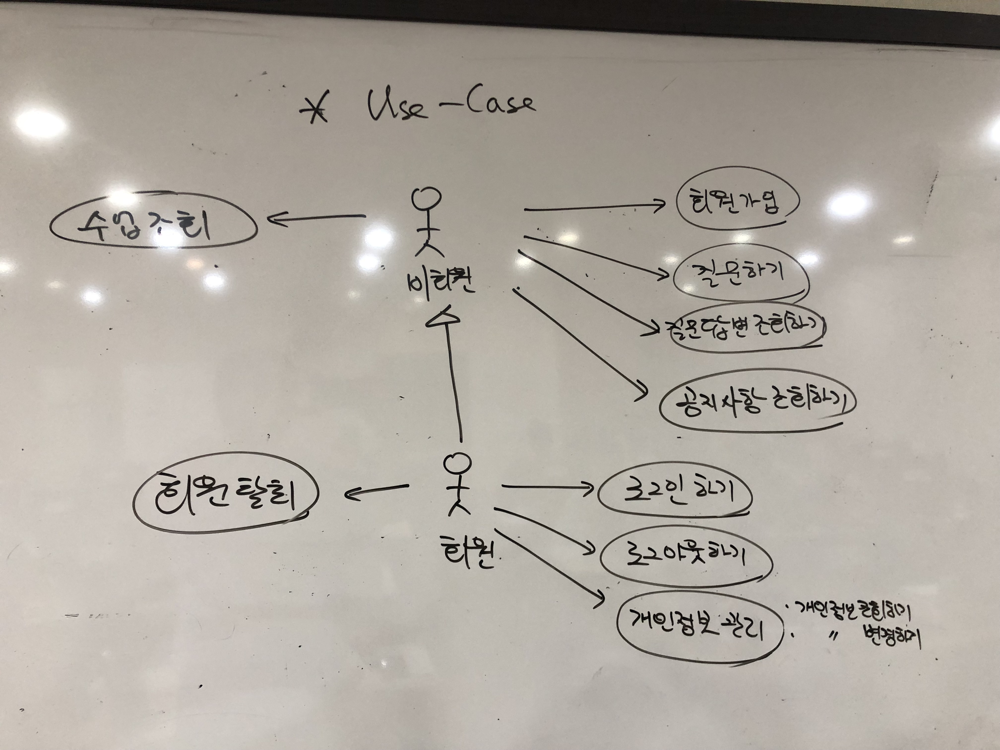
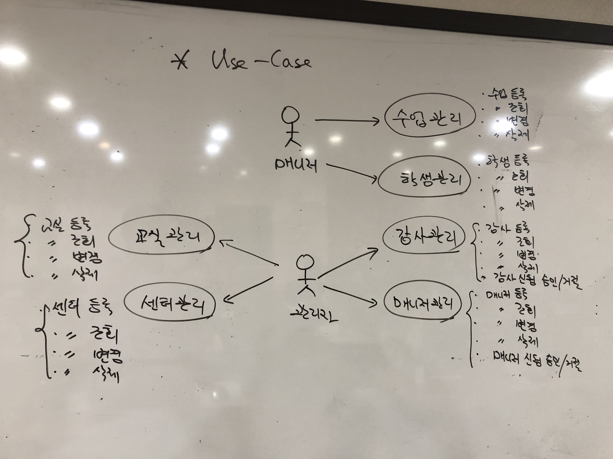
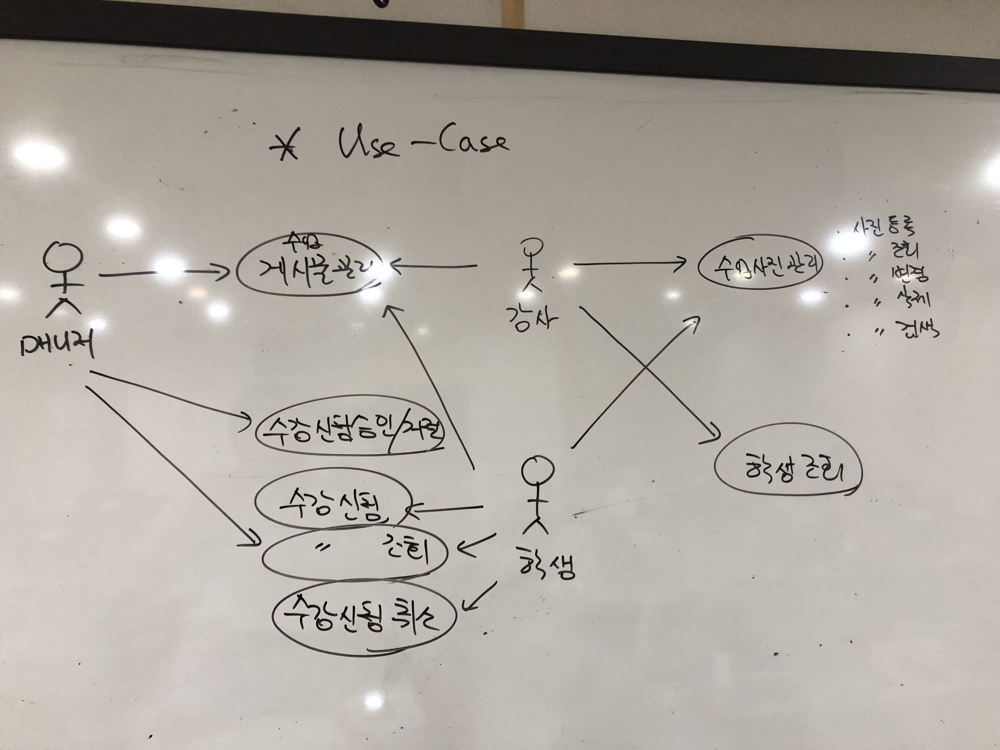

# 유스케이스

## Actors

### 비회원
- 시스템에 로그인 하지 않은 사용자

### 회원
- 시스템에 로그인 한 사용자

### 관리자
- 관리자에 등록된 로그인 사용자

### 매니저
- 매니저로 등록된 로그인 사용자

### 강사
- 강사로 등록된 로그인 사용자

### 학생
- 학생으로 등록된 로그인 사용자

## Use-Cases

### [회원가입](uc001-SignUp.md)(비회원)
- 비회원이 로그인을 위해 회원에 가입하는 것.

### 회원탈퇴(회원)
- 회원이 서비스에서 탈퇴하는 것.

### 질문하기(비회원, 회원)
- 비회원 및 회원이 질문하는 것

### 질문 변경하기(비회원, 회원, 매니저)
- 비회원 및 회원이 자신이 질문한 것을 변경하는 것
- 매니저가 질문을 변경하는 것

### 질문 삭제하기(비회원, 회원, 매니저)
- 비회원 및 회원이 자신이 질문한 것을 삭제하는 것
- 매니저가 질문을 삭제하는 것

### 답변하기(매니저)
- 매니저가 회원/비회원이 질문한 것을 답변하는 것

### 답변 삭제하기(매니저)
- 매니저가 답변한 것을 삭제하는 것

### 질문답변조회하기(비회원, 회원)
- 비회원, 회원이 질문 답변을 조회하는 것

### 공지사항 관리(매니저)
- 매니저가 공지사항을 등록, 조회, 수정, 삭제 하는 것

### 공지사항 조회(비회원, 회원)
- 공지사항을 조회하는 것

### 수업 관리(매니저)
- 교육센터에서 진행하는 수업을 관리(등록,조회,수정,삭제)하는 것

#### 수업 조회(비회원, 회원)
- 수업 내용을 조회하는 것

#### 강의 수업 조회(강사)
- 강의를 담당하고 있는 수업을 조회하는 것

### 로그인 하기(회원)
- 회원이 로그인을 하는 것

### 로그아웃 하기(회원)
- 로그인된 회원이 로그아웃을 하는 것

### 개인정보 관리(회원)
- 회원이 자신의 정보를 조회, 변경하는 것

### 학생관리(매니저)
- 학생을 등록, 조회, 변경, 삭제하는 것

### 학생조회하기(강사)
- 담당하고 있는 수업의 학생을 조회하는 것 

### 강사관리(관리자)
- 강사를 등록, 조회, 변경, 삭제하는 것

### [매니저관리](uc002-ManagerManagement.md)(관리자)
- 매니저를 등록, 조회, 변경, 삭제하는 것

### 교실관리(관리자)
- 교실을 등록, 조회, 변경, 삭제하는 것

### 센터관리(관리자)
- 센터를 등록, 조회, 변경, 삭제하는 것

### 수강신청하기(학생)
- 개설된 수업에 대해 수강을 신청하는 것

### 수강신청 승인/거절하기(매니저)
- 수강 신청을 승인하거나 거절하는 것

### 수강신청 조회(학생, 매니저)
- 수강 신청 내용을 조회하는 것

### 수강신청 취소하기(학생)
- 수강 신청을 취소하는 것

### 강사 배정하기(매니저)
- 수업에 강의를 담당할 강사를 배치하는 것

